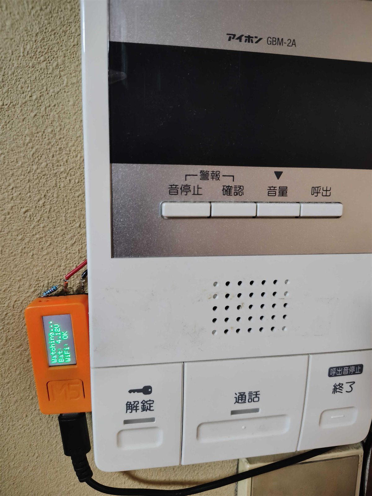
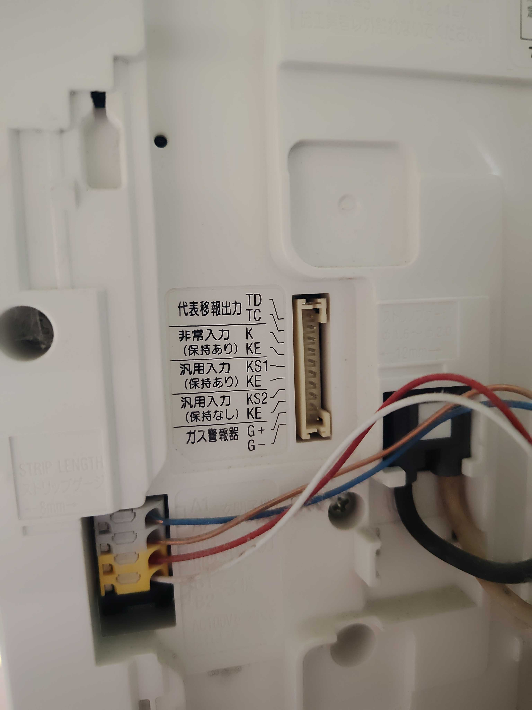
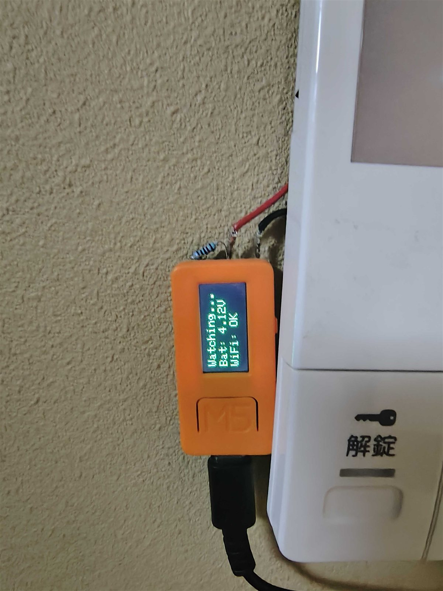

# interphone-doorbell-webhook

集合住宅のインターホン親機（アイホン GBM-2A）の代表移報出力を ESP32 マイコンで監視し、玄関・エントランスの呼出を検知したら Webhook を送信してスマホに通知するシステム。

インターホン本体は無改造（既設の外部出力端子に配線を追加するだけ）で、原状回復可能。



```
玄関子機／集合玄関機
        │ 呼出
        ▼
  GBM-2A（親機）
        │ TD/TC（代表移報出力・無電圧接点）
        ▼
   ESP32（M5StickC / M5Atom Echo）
        │ WiFi
        ▼
   Webhook 送信先（ntfy / Make / n8n / Home Assistant 等）
        │
        ▼
      スマホ通知
```

## 仕組み

GBM-2A は呼出受信中に「代表移報出力（TD/TC）」という無電圧オープンコレクタ接点を閉じる。これを ESP32 の GPIO で監視する。

```
GBM-2A                    ESP32
  TD (+) ─────────────────── 入力 GPIO
                               │
                             10kΩ（外部プルアップ）
                               │
  TC (-) ─────────────────── GND
                             3.3V（プルアップ電源）
```

| 状態 | TD-TC間 | GPIO電位 |
|------|---------|---------|
| 待受 | 開放 | HIGH |
| 呼出受信中 | 導通 | LOW |

HIGH→LOW の立下りエッジを検知条件とし、チャタリング除去（200ms）と再通知抑制（10秒）を入れている。

GBM-2A 側の端子部。左上の TD/TC が代表移報出力:



待機中の M5StickC。LCD に監視状態・バッテリー電圧・WiFi 状態を表示。プルアップ抵抗は本体上部に直付け:



## ファームウェア（2バリアント）

| | M5StickC | M5Atom Echo |
|---|---|---|
| ディレクトリ | `m5stickc/` | `m5atom_echo/` |
| 通知フィードバック | LCD 表示 | 内蔵スピーカー（I2S・NS4168）でビープ + RGB LED |
| 状態表示 | LCD（WiFi 状態・充電モード） | RGB LED（青=接続中 / 緑=待機 / 赤=切断） |
| 入力ピン | GPIO36（入力専用） | GPIO21（ボトム拡張ピン） |
| 追加機能 | バッテリーケア（下記） | — |

### M5StickC のバッテリーケア

常時給電で運用するため、電源管理 IC（AXP192）のレジスタを直接制御して充電終止電圧を 4.2V → 4.1V に下げ、満充電張り付きによる内蔵バッテリーの劣化を抑えている（ボタン長押しで 100% 充電モードに切替可能）。

## ビルド・書き込み

PlatformIO を使用。

```bash
cd m5stickc   # または m5atom_echo
cp src/config.h.example src/config.h
# config.h に WiFi SSID / パスワード / Webhook URL を設定
pio run -t upload
```

## 設計メモ

- **フォトカプラの省略**: 配線が数十 cm と短く、両機器とも絶縁済み SMPS 電源で、10kΩ が電流制限として機能するため、リスク評価のうえ直結とした（詳細は[仕様書](仕様書.md)）
- **GPIO36（M5StickC）**: ESP32 の入力専用ピンで内部プルアップがないため、外部 10kΩ プルアップが必須
- **KE 端子は使用不可**: GBM-2A の KE はボタン入力回路専用のコモンで、TD/TC 出力の GND としては使えない

ハードウェア仕様・回路・設置手順の詳細は [仕様書.md](仕様書.md) を参照。

## 開発について

回路設計の検討（端子仕様の調査、フォトカプラ省略のリスク評価）からファームウェア実装まで、Claude Code を併用して開発。

## ライセンス

MIT
